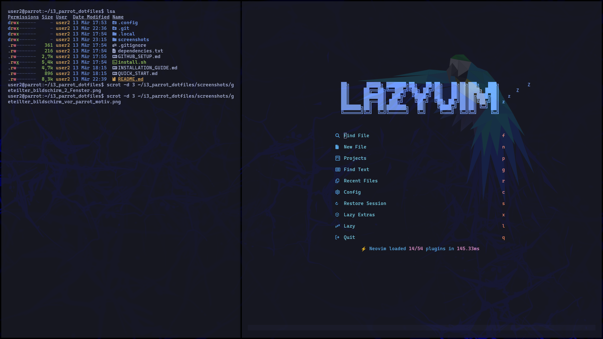
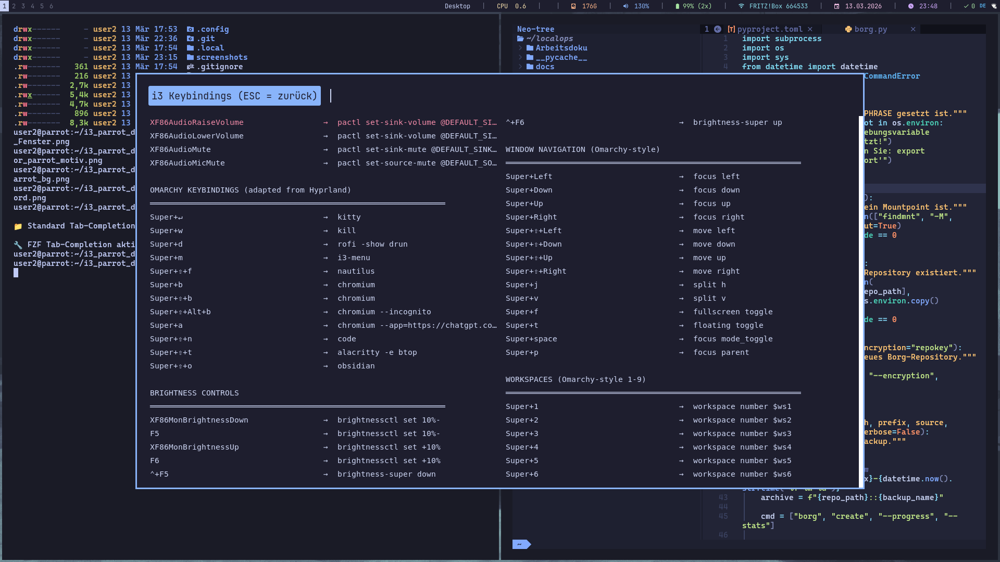
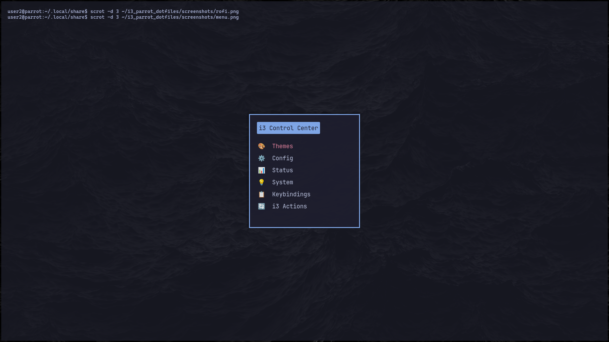
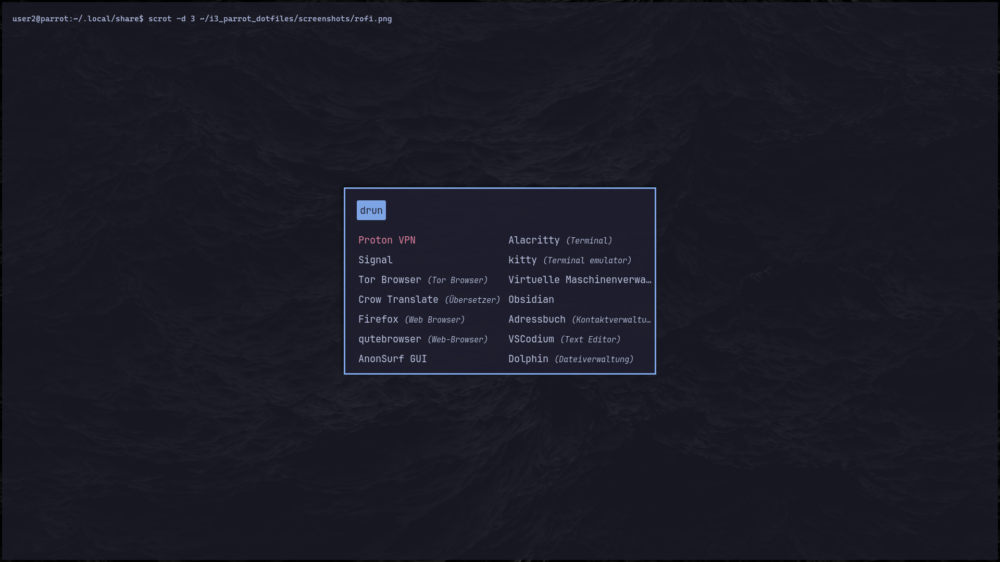
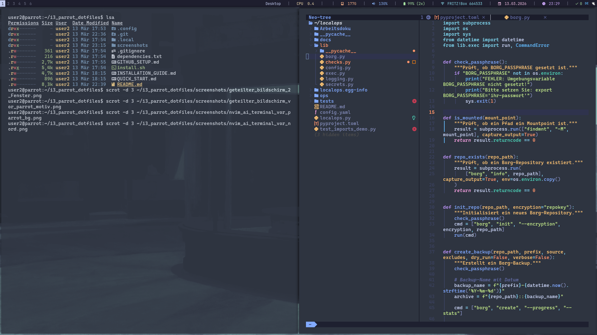
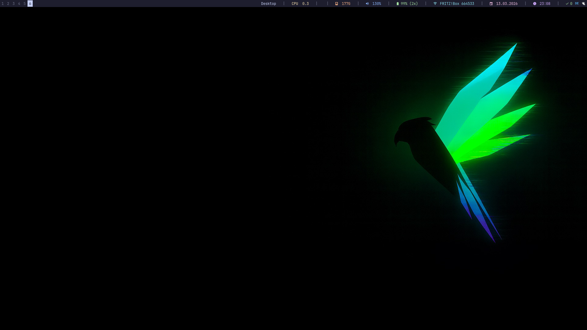

# i3 Parrot Dotfiles

Das ist meine persönliche i3-wm-Konfiguration. Sie ist orientiert am Design von Omarchy, aber komplett umgeschrieben für i3wm und Parrot OS.
Der Fokus liegt auf Produktivität, Anpassbarkeit und der zentralen Theme-Integration mit einer Reihe von täglich gebrauchten Apps:
(Alacritty, Kitty, Neovim, VSCode, btop, firefox etc.)
Kurz: ich wollte einen chicken und bequemen Tiling-Window-Manager ohne Abstriche bei etablierten Sicherheitspraktiken zu machen:

- **X11 statt Wayland**: Volle Kompatibilität mit Pentesting- und Security-Tools (Burp Suite, Wireshark, xdotool), die Wayland teilweise blockiert.
- **Keine Auto-Updates von fremden Repositories**:  
 Im Gegensatz zu Omarchy gibt es keine automatischen GitHub-Pulls.
   Jede Änderung wird manuell geprüft (Supply-Chain-Security)
- **Debian-stable statt Arch-bleeding-edge**: Nutzt Parrots
  gehärtete, getestete APT-Pakete statt experimenteller
  AUR-Builds
- **Minimale Angriffsfläche**: Nur 8 Theme-Scripts statt 40+
  Omarchy-Tools - weniger Code bedeutet weniger potentielle Bugs
- **Parrot-OS-Hardening**: Volle Integration mit Parrots
  Security-Features (AppArmor-Profile, gehärteter Kernel, etc.)



## ⌨️ Keybindings



*Alle Shortcuts kategorisiert und durchsuchbar über `Super+M` → Keybindings anzeigen*

## 📸 Screenshots

### Desktop & Workflow

<div align="center">

| i3 Control Center | Rofi Launcher |
|-------------------|---------------|
|  |  |
| Zentrales Menü für Theme-Wechsel & System-Steuerung | Schneller App-Launcher mit Fuzzy-Search |

</div>

### Features & Integration

<div align="center">

| Nord Theme | i3blocks Statusbar |
|------------|-------------------|
|  |  |
| Theme-Integration: Neovim, Terminals, VSCode, btop | System-Monitoring: CPU, RAM, Updates, Netzwerk |

</div>

## ✨ Features

- **Theme-Management-System** - 14 vorgefertigte Themes (Tokyo Night, Catppuccin, Gruvbox, Nord, etc.)
- **Rofi Application Launcher** - Schneller App-Start mit `Super+D`
- **i3blocks Statusbar** - System-Monitoring (CPU, RAM, Updates, Netzwerk)
- **Update-Benachrichtigungen** - Automatische APT-Update-Checks alle 2 Stunden
- **Optimiert für Terminals** - Alacritty & Kitty mit Theme-Integration
- **Control Center** - Zentrales i3-Menü (`Super+M`) für Einstellungen, Theme-Wechsel, Updates, etc.
- **Schnellzugriff** - Viele Keybindings für effiziente Navigation und Systemsteuerung

## 📦 Dependencies

### Basis-Installation

```bash
sudo apt update
sudo apt install -y i3-wm i3blocks i3lock i3status \
                    rofi feh dunst picom \
                    alacritty kitty \
                    nm-applet xss-lock dex
```

### Nerd Fonts (empfohlen)

```bash
# CaskaydiaMono Nerd Font für Icons in Terminal und i3blocks
mkdir -p ~/.local/share/fonts
cd ~/.local/share/fonts
wget https://github.com/ryanoasis/nerd-fonts/releases/download/v3.1.1/CascadiaCode.zip
unzip CascadiaCode.zip
fc-cache -fv
```

Siehe [dependencies.txt](dependencies.txt) für die komplette Liste.

## Installation

### Automatisch

```bash
git clone https://github.com/DEIN-USERNAME/i3-parrot-dotfiles.git
cd i3-parrot-dotfiles
chmod +x install.sh
./install.sh
```

### Manuell

```bash
# 1. Dependencies installieren
sudo apt install -y $(cat dependencies.txt | grep -v "^#" | tr '\n' ' ')

# 2. Configs kopieren
cp -r .config/* ~/.config/
cp -r .local/bin/* ~/.local/bin/

# 3. Skripte ausführbar machen
chmod +x ~/.local/bin/i3-*
find ~/.local/bin/i3-theme/ -type f -exec chmod +x {} \;

# 4. i3 neu starten
# Log out und wieder ein, oder:
i3-msg restart
```

## Wichtige Keybindings

### Basis

| Keybinding | Aktion |
|------------|--------|
| `Super+Return` | Terminal öffnen (Kitty) |
| `Super+D` | Rofi Application Launcher |
| `Super+M` | i3 Control Center (Theme, Config, Updates) |
| `Super+W` | Fenster schließen |
| `Super+Shift+Q` | i3 beenden |

### Navigation

| Keybinding | Aktion |
|------------|--------|
| `Super+H/J/K/L` | Fokus wechseln (Vim-Style) |
| `Super+Shift+H/J/K/L` | Fenster verschieben |
| `Super+1...9` | Workspace wechseln |
| `Super+Shift+1...9` | Fenster zu Workspace verschieben |

### Themes & Design

| Keybinding | Aktion |
|------------|--------|
| `Super+Shift+Y` | Nächstes Theme |
| `Super+Shift+W` | Nächster Wallpaper |
| `Super+Ctrl+T` | Transparenz togglen |

### System

| Keybinding | Aktion |
|------------|--------|
| `Super+B` | Browser (Chromium) |
| `Super+A` | ChatGPT App |
| `Super+Shift+F` | Dateimanager |
| `Super+Shift+T` | Taskmanager (btop) |

**Alle Keybindings anzeigen:** `Super+M` → Keybindings anzeigen

## 🎨 Theme System

Das Theme-System wurde von [Omarchy](https://github.com/ohmarch/omarchy) adaptiert und für i3wm + Parrot OS umgeschrieben.

### Features

- **14 Professionelle Themes**: Tokyo Night, Catppuccin, Gruvbox, Nord, etc.
- **Wallpaper-Sammlungen**: Jedes Theme hat mehrere Wallpapers (bis zu 16 pro Theme)
- **Automatisches App-Theming**: Themes werden automatisch angewendet auf:
  - Alacritty & Kitty (Terminals)
  - Neovim & VSCode (Editoren)
  - btop (System-Monitor)
- **Einfaches Wechseln**: Theme ändern mit einem Tastendruck
- **Background-Cycling**: Wechsle zwischen Wallpapers ohne Theme zu ändern

### Themes wechseln

```bash
# Per CLI
i3-theme-next
i3-theme-set tokyo-night    # Setze Theme
i3-theme-bg-next            # Nächster Background
```

### Verfügbare Themes

- Tokyo Night
- Catppuccin (Mocha & Latte)
- Gruvbox
- Nord
- Everforest
- Rose Pine
- Kanagawa
- Hackerman
- ... und 6 weitere

### Wie es funktioniert

- Themes liegen in `~/.config/i3-themes/themes/THEME_NAME/`
- Jedes Theme enthält Wallpapers und App-spezifische Farbschemata
- Aktuelles Theme ist verlinkt nach `~/.config/i3-themes/current/theme`
- Apps referenzieren diesen Symlink für automatische Theme-Updates

### Eigene Themes hinzufügen

```bash
mkdir ~/.config/i3-themes/themes/mein-theme
mkdir ~/.config/i3-themes/themes/mein-theme/backgrounds
# Theme-Dateien erstellen (siehe existing themes als Vorlage)
i3-theme-set mein-theme
```

## 📂 Projektstruktur

```
~/.config/
├── i3/config                    # i3 Hauptkonfiguration
├── i3blocks/config              # Statusbar-Konfiguration
├── i3-themes/                   # Theme-System
│   ├── themes/                  # 14 Themes
│   ├── current/                 # Symlinks zum aktiven Theme
│   └── hooks/                   # Post-Theme-Change-Hooks
├── alacritty/alacritty.toml    # Terminal-Config (Theme-integriert)
├── rofi/config.rasi            # App-Launcher-Config
├── picom/picom.conf            # Compositor (Transparenz)
└── dunst/dunstrc               # Notifications

~/.local/bin/
├── i3-menu                      # Control Center
├── i3-theme-next               # Theme-Wechsel-Script
├── i3blocks-updates            # Update-Anzeige
├── update-checker              # Update-Benachrichtigungen
└── i3-theme/                   # Theme-System-Skripte
    ├── i3-theme-set
    ├── i3-theme-list
    └── ... (8 Skripte)
```

## 🔧 Anpassungen

### Eigene Wallpaper

```bash
# Wallpaper zu Theme hinzufügen
cp dein-wallpaper.jpg ~/.config/i3-themes/current/theme/backgrounds/
i3-theme-bg-next  # Wallpaper wechseln
```

### Eigene Keybindings

Bearbeite `~/.config/i3/config` und füge hinzu:

```bash
bindsym $mod+x exec --no-startup-id dein-befehl
```

### i3blocks anpassen

Bearbeite `~/.config/i3blocks/config` für zusätzliche Module.

## 🐛 Troubleshooting

### Theme wechselt nicht

```bash
# Prüfe ob Theme-Skripte im PATH sind
echo $PATH | grep i3-theme
export PATH="$HOME/.local/bin/i3-theme:$PATH"

# Teste manuell
i3-theme-set tokyo-night
```

### Rofi startet nicht

```bash
# Prüfe Installation
which rofi
sudo apt install rofi

# Teste manuell
rofi -show drun
```

### Icons fehlen in i3blocks

```bash
# Installiere Nerd Font (siehe oben)
# Prüfe ob Font aktiv ist
fc-list | grep -i cascadia
```

### Updates werden nicht angezeigt

```bash
# Teste Update-Check
~/.local/bin/update-checker

# Logs prüfen
tail -f /tmp/update-checker.log
```

## 🤝 Credits

- **Theme-System** - Adaptiert von [Omarchy](https://github.com/ohmarch/omarchy)
- **i3 Community** - Inspiration und Tutorials
- **Parrot OS** - Exzellente Debian-Distribution

## 📝 Lizenz

MIT License - Siehe [LICENSE](LICENSE)

## 💼 Autor

Erstellt für den Einsatz auf Parrot OS mit Fokus auf Produktivität und Anpassbarkeit.

**Entwickelt im Rahmen meiner Linux-Lernreise** - Dokumentiert in meinem [Obsidian Zettelkasten](https://github.com/DEIN-USERNAME/linux-zettelkasten).
